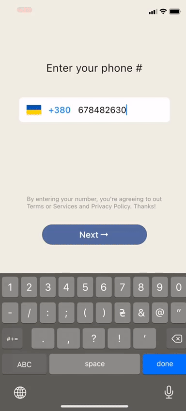
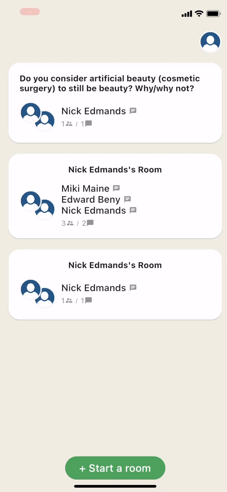

# Dialogi

Audio Chatting App written with Flutter and Firebase

## Preview

 
 
 

## Dependencies

- agora_rtc_engine: https://pub.dev/packages/agora_rtc_engine

- permission_handler: https://pub.dev/packages/permission_handler

- firebase_auth: https://pub.dev/packages/firebase_auth

- cloud_firestore: https://pub.dev/packages/cloud_firestore

- country_code_picker : https://pub.dev/packages/country_code_picker

- pull_to_refresh : https://pub.dev/packages/pull_to_refresh

## Getting started

#### Requirements

- Firebase CLI
- Flutter Fire configurator

- Firebase configure

`dart pub global activate flutterfire_cli`

`flutterfire configure --project=<firebaseProjectName>`

#### 1. [Setup Flutter](https://flutter.dev/docs/get-started/install).

#### 3. Run `flutter pub get`.

#### 4. Setup the Firebase App

#### 5. Setup the Agora

#### 6. Run the project using `flutter run` or using your IDE's tools.

### 7. Splash Screen: `dart run flutter_native_splash:create`
